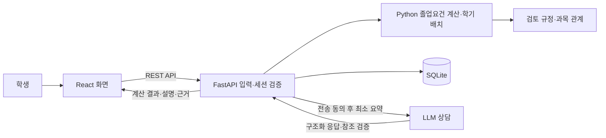

# PATH · 나의 졸업 로드맵

현재까지 이수한 과목으로 부족한 졸업요건을 확인하고, 남은 학기의 수강 계획을 비교·수정하는 졸업작품 프로젝트입니다. **React + TypeScript 프론트엔드, Python/FastAPI 백엔드, SQLite DB, LLM 상담**을 구현했습니다.

- 대상: **홍익대학교 세종캠퍼스 소프트웨어융합학과 2018~2026학번 · 심화/일반과정**
- 업데이트: **2026-10-08** · 제출 목표: **2026-11-09**
- 상태: 로컬 실행·시연 가능. 공식 졸업사정을 대신하지 않는 **참고 계획**입니다.


## 바로 실행하기

Windows에서 Python 3.11 이상과 Node.js 22.12 이상 또는 24 LTS를 준비하세요. 검증 환경은 Python 3.12와 Node.js 24입니다. 처음 설치할 때는 인터넷이 필요합니다.

```powershell
git clone https://github.com/yun-user/university_academic_ai.git
cd university_academic_ai
.\setup_web.cmd
.\start_web.cmd
```

- 앱: <http://127.0.0.1:8000/>
- REST API 문서: <http://127.0.0.1:8000/docs>
- 화면에서 **예시로 둘러보기**를 누르면 개인정보 없는 가상 8과목으로 시작합니다.
- 첫 화면 상단에서 **입학연도 (학번)**와 **이수 과정**을 선택하세요. 선택한 학번의 적용 기준이 바로 표시됩니다.
- 이후에는 `start_web.cmd`만 실행합니다. 종료는 실행 터미널에서 `Ctrl+C`입니다.
- Git에는 프론트 빌드 결과와 의존성이 포함되지 않으므로 최초 `setup_web.cmd`가 필요합니다.

기본 계산·계획 비교·DB 저장에는 API 키가 필요하지 않습니다. LLM 상담을 사용하려면 아래 설정을 추가하세요.

## 주요 기능

| 기능 | 현재 구현 |
| --- | --- |
| 학번별 적용 기준 | 2018~2026학번 선택, 심화/일반 18개 조합, 영역별 기준·출처 표시 |
| 이수 내역 입력 | 직접 편집, 클래스넷 성적표 붙여넣기, CSV 가져오기, 적용 전 미리보기 |
| 졸업요건 점검 | 총학점·전공·교양·MSC·설계·필수과목, 재수강·F·수강중·미확인 구분 |
| 학기별 로드맵 | 입력된 개설·선수·병수·중복·학점 상한을 고려한 자동 배치 |
| 계획 비교·수정 | 15/18학점 비교, 마지막 학기 9학점 등 개별 상한, 과목 이동·추가·제거와 재검사 |
| 과목 관계 편집 | 후보 과목, 선수/병수, 동일·대안 과목, 기간·방향·과정별 대체인정 |
| LLM 졸업 상담 | 현재 계산에 기반한 설명·추천 이유, 실제 응답 모드, 점검 항목·규정 출처 표시 |
| DB 관리 | 계획 생성·조회·수정·삭제, 저장 이력, 동시 수정 충돌 검출 |
| 보고서·백업 | HTML 보고서, 과목 CSV, 전체 입력 JSON 백업·복원, 기존 Streamlit v2 백업 지원 |
| 졸업 준비 | 할 일·기한·메모·완료 체크리스트. 완료 체크는 학교 승인과 별개 |
| 규정·평가 | 원본 해시·검토 사항, 합성 평가, 실제 대조·LLM·사용성 평가 기록과 시간 측정 |
| 선택적 계정 | 앱 가입·로그인·로그아웃, 계정별 계획·평가 접근 제어 |

학번을 바꾸면 이수 과목을 유지하며 계산·AI 문맥·보고서·저장에 새 기준을 적용합니다. 승인 상태·대체인정 확인은 초기화하고 수동 배치는 자동 계획으로 전환합니다. 과거 수강연도를 입학연도로 자동 추정하지 않습니다.

2018학번에는 별도 특성화교양 필수를 넣지 않으며, 2022학번부터 SW·데이터활용 9학점을 점검합니다. 일반과정은 2024학번부터 과학 이론·실험 한 세트를 확인합니다. **SW·데이터 인정학점**은 과목 상세에서 학교가 인정한 값만 입력하세요. 총학점에는 같은 과목을 두 번 더하지 않습니다. [학번별 기준과 검증 기록](docs/졸업로드맵_학번선택과검증.md)

학교 비밀번호를 앱에 입력하는 자동 로그인·공식 API 연동은 제공하지 않습니다. 학교에서 직접 로그인한 후 성적표를 붙여넣거나 CSV를 가져옵니다. 기존 Streamlit의 별도 브라우저 가져오기는 로그인 반복 새로고침 문제가 있어 실제 자동 연동 완료로 제시하지 않습니다.

## 기술 구성

| 구분 | 기술·구현 위치 |
| --- | --- |
| UI/UX | 반응형 대시보드, 단계별 입력·미리보기, 오류·미저장 상태, `frontend/src/` |
| 프론트엔드 | React 19, TypeScript, Vite, CSS |
| 백엔드 | Python, FastAPI, Pydantic, `backend/` |
| 계산기 | 규정·중복·설계학점 계산, 조건 기반 배치, `src/planning/` |
| DB | SQLite 6개 테이블, 트랜잭션·외래키·버전·스키마 이전 |
| LLM | OpenAI Responses API, 구조화 출력·참조 검증 |
| 테스트 | pytest, FastAPI TestClient, Streamlit AppTest, 브라우저 수동 검증 |



학점과 충족 여부는 Python이 계산하며 LLM은 계산 결과를 설명하고 추천 우선순위를 제안합니다. 추천은 다시 제약 검사를 거칩니다. 수동 배치에 오류가 있으면 이전 결과를 숨기고 수정할 조건을 표시합니다. 계획은 최단 졸업이나 전역 최적해를 보장하지 않습니다.

## LLM 설정과 데이터 보관

프로젝트 루트에 `.env` 파일을 만들고 본인의 설정을 넣습니다. **실제 키를 Git에 커밋하지 마세요.**

```dotenv
OPENAI_API_KEY=본인의_API_키
OPENAI_MODEL=사용할_모델명
```

화면에서 전송 항목을 확인·동의한 뒤 AI 상담을 요청합니다. 이용 비용이 발생할 수 있습니다. 실제 응답은 `LLM 답변 · 모델명`, 연결·검증 실패는 `AI 답변 미생성`으로 구분합니다. 입력을 변경하거나 불러오면 동의와 기존 상담이 초기화됩니다.

- 성적 등급·학교 계정·체크리스트 개인 메모는 LLM 요청에서 제외합니다. 질문에 직접 쓴 개인정보는 전송될 수 있습니다.
- 저장한 과목·성적·계획은 기본적으로 `data/private/planner.sqlite3`에 남습니다. 별도 경로는 `PLANNER_DB_PATH`로 지정합니다.
- 키, 개인 DB, 성적 백업, 업로드 자료, 의존성·캐시는 Git에서 제외합니다.
- 전체 입력 JSON에는 성적·개인 메모가 포함될 수 있습니다. 공유 전에 내용을 확인하세요.

### 계정별 분리 시연

기본은 로컬 단일 사용자 모드입니다. 앱 전용 계정을 사용하려면 서버를 끈 후 PowerShell에서 실행합니다.

```powershell
$env:PLANNER_AUTH_REQUIRED='1'
.\start_web.cmd
```

학교 계정과 별개입니다. 비밀번호는 salt를 적용한 scrypt 해시로 보관하고, 세션은 8시간 만료·HttpOnly·SameSite=Strict 쿠키를 사용합니다. 계획·이력·평가의 소유권을 검사합니다. 기존 로컬 계획은 백업 후 해당 계정에서 복원·저장하세요. 외부 공개에는 TLS·계정 복구·운영 정책 등의 추가 검토가 필요합니다.

## 개발·검증

프론트와 백엔드를 나누어 실행할 수 있습니다.

```powershell
# 터미널 1: 프로젝트 루트
.venv/Scripts/python.exe -m uvicorn backend.app:app --host 127.0.0.1 --port 8000 --no-access-log
```

```powershell
# 터미널 2
cd frontend
npm.cmd run dev
```

개발 화면은 <http://127.0.0.1:5173/>이며 Vite가 `/api`를 8000으로 전달합니다. 배포 빌드는 `frontend`에서 `npm.cmd run build`로 생성합니다.

```powershell
# 전체 테스트에는 검색 앱 의존성도 필요합니다.
.venv/Scripts/python.exe -m pip install -r requirements.txt -r requirements-web.txt pytest
$env:LLM_ENABLED='false'
.venv/Scripts/python.exe -m pytest -q
.venv/Scripts/python.exe -m scripts.evaluate_planner
```

학번 선택 추가 후 전체 Python 테스트 **512개 통과(35.99초)**, TypeScript·Vite 빌드 성공, 합성 시나리오 **32/32** 통과. 학번별 18개 조합, SQLite v2→v3 이전, 기존 백업·CSV 호환, AI 문맥·보고서·계획 비교의 학번 전달을 검사했습니다. 실제 브라우저 확인과 배포본 검증은 [학번 선택 검증 기록](docs/졸업로드맵_학번선택과검증.md)을 참조하세요. 의존성의 폐기 예정 API 경고 2건이 남아 있습니다. [이전 GitHub 게시 검증 기록](docs/verification-github-20261007.json)

이는 구현 검증입니다. **실제 학생의 졸업판정 정확도나 사용자 만족도를 측정한 결과가 아닙니다.** 새 PC 최초 설치도 별도 확인이 필요합니다. [상세 보강·검증 기록](docs/졸업로드맵_최종보강과검증.md)

## 규정 적용 범위와 남은 확인

첨부 2026 이수체계도의 필수 선수·병수와 권장 순서를 구분해 반영했습니다. 2019.12 학과 내규와 2026 공통 자료가 충돌하는 부분은 검토 메모에 남겼습니다. 클래스넷에서 연결된 교과과정 원본은 파일명에 ‘안’이 있어 확정본으로 취급하지 않습니다.

- 2018~2026학번 최종 확정 기준과 학과 내규 최신판 (2021학번 이후 심화의 학과 지정 과학과목 포함)
- 공식 대체 승인표·MSC 인정 목록, 실제 개설과 개별 면제
- 수강연도별 설계학점과 실제 졸업사정 결과 대조
- 실제 학생 사용성·LLM 답변 평가, 교수자 평가표·제출 형식

[첨부 자료 검토·남은 확인 사항](docs/졸업로드맵_최종보강과검증.md)과 [규정 대조 기록](docs/졸업로드맵_규정확인과_검증.md)을 참조하세요.

## 기존 Streamlit 앱

| 앱 | 설치 | 실행 | 역할 |
| --- | --- | --- | --- |
| 졸업 로드맵 | `setup_planner.cmd` | `start_planner.cmd` | Python 화면의 로드맵·LLM·학교 성적표 가져오기 |
| 학사정보 검색 | `setup.cmd` | `start.cmd` | 문서 검색·출처 답변·문서 관리·OCR·평가 |

기존 검색 앱은 PDF·CSV·TXT, BM25+의미 검색, 원문 출처, 검토 규정, OCR 승인과 문서 버전 관리를 지원합니다. 검색 모델·OCR 준비에는 추가 다운로드가 필요합니다. 검토된 졸업규정·학교 학사안내는 색인이 없는 상태에서도 답할 수 있습니다.

## 문서와 기여

- [웹앱 실행·구조도·DB·REST·시연](docs/졸업로드맵_웹앱구조와시연.md)
- [2018~2026학번 선택·요건 차이·검증](docs/졸업로드맵_학번선택과검증.md)
- [최종 기능 보강·검증·실제 평가 계획](docs/졸업로드맵_최종보강과검증.md)
- [개발 계획과 11월 9일 제출 일정](docs/졸업로드맵_개발계획.md)
- [Streamlit 로드맵 설명서](docs/졸업로드맵_실행및시연.md)
- [학교 성적표 가져오기](docs/졸업로드맵_학교연동.md)
- [기존 검색 앱 사용설명서](docs/사용설명서.md)

변경 시 재현 방법과 관련 테스트 결과를 함께 남겨 주세요. 규정 수정에는 원본·적용 학번·수강연도·확인 상태를 기록하고, 확정되지 않은 내용을 승인된 기준으로 바꾸지 않습니다. 실제 성적·계정 정보·API 키는 이슈나 PR에 올리지 마세요.
