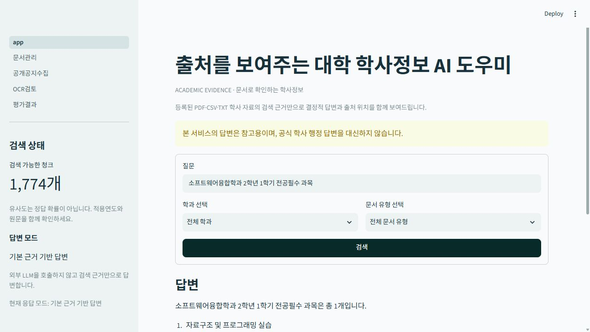

# 출처를 보여주는 대학 학사정보 AI 도우미

Python + Streamlit으로 만든 로컬 학사정보 검색·답변 앱입니다.

## 실행

1. Python 3.11 이상을 설치하고 ZIP을 모두 풉니다.
2. `setup.cmd`를 실행해 패키지·검색 모델·OCR 언어 데이터를 준비합니다.
3. `start.cmd`를 실행하고 http://127.0.0.1:8501 에 접속합니다.

검색과 기본 답변에는 API 키가 필요하지 않습니다. 최초 설치와 모델 다운로드는 인터넷이 필요합니다. 관리자 비밀번호는 설치 시 `.env`의 `ADMIN_PASSWORD`에 생성됩니다.

## 포함 기능

- PDF·CSV·TXT 전처리와 페이지·데이터 행·URL 출처 표시
- 한국어 BM25 + 의미 검색의 RRF 결합, 근거가 약한 질문 보류
- 과목명·학수번호 정확 조회와 학년·학기별 전체 과목 조회
- 문서 업로드·버전 교체·비활성화·재활성화·검색 반영
- 공개 HTTPS 공지 본문 수집과 원문 스냅샷 보존
- 한국어·영어 OCR, 원본 대조, 페이지별 승인 후 색인
- 선택적 LLM의 원문 인용 선택과 검증 실패 시 기본 답변 전환
- 118문항 회귀 평가 데이터, CLI 평가, 평가 결과 화면
- 기존 테스트를 포함한 자동 테스트 291개 통과 (2026-10-01)
- 2026 교과과정 책자(안)의 AID융합과학기술대학 졸업학점표로 2021학번 이후 심화과정과 일반(비인증)과정 졸업요건 안내
- 학교 홈페이지 대학학사안내(조기졸업·학위취득유예·수료학점·성적경고·수강학점·출석·성적평가) 검토 전사본 답변
- 설계교과목 전체 인정학점 안내와 수강연도별 적용 구분
- 자연어 개발 질문 31개 답변 기록, 관리자 수동 채점, 미채점과 실제 품질 점수 구분
- 관리자 화면에서 실제 평가 질문·작성 출처·기대 답변 등록 및 답변 수집 실행
- 입학연도·일반/심화과정 선택, 검토한 학과 졸업표와 2024년 어학 대체 폐지 공지 답변

## 설명서

- [2026-10-01 코드 검토·수정 사항과 제출 전 준비](docs/저장소검토_2026-10-01.md)
- [설치·사용·설정 설명서](docs/사용설명서.md)
- [검증 결과와 평가 범위](docs/검증결과.md)
- [개발 구성과 변경 내역](docs/개발가이드.md)
- [개정 자료 반영과 졸업과제 준비](docs/개정자료반영_2026-09-12.md)
- [자연어 평가 실행·채점·학생 질문 수집 방법](docs/자연어평가_진행방법.md)

현재 버전은 로컬 졸업작품 시연용입니다. 외부 LLM 키·모델은 사용자가 선택하며, 스캔 문서의 OCR 결과는 원문 대조 후 승인해야 합니다. 자동 생성 회귀 평가 결과를 실제 학생 질문 전체의 정확도로 해석하지 마세요.

기존 저장소의 장기 계획과 이전 README는 docs에 보존했습니다. 현재 구현 상태는 위 사용설명서를 기준으로 확인하세요.

최신 추가 기능: 자연어 졸업요건 질문, 학과 범위 제한, 원문에 연결된 표 요약, 숫자 범위 취소선 방지, `connect_openai.cmd`를 통한 OpenAI 연결 설정.
