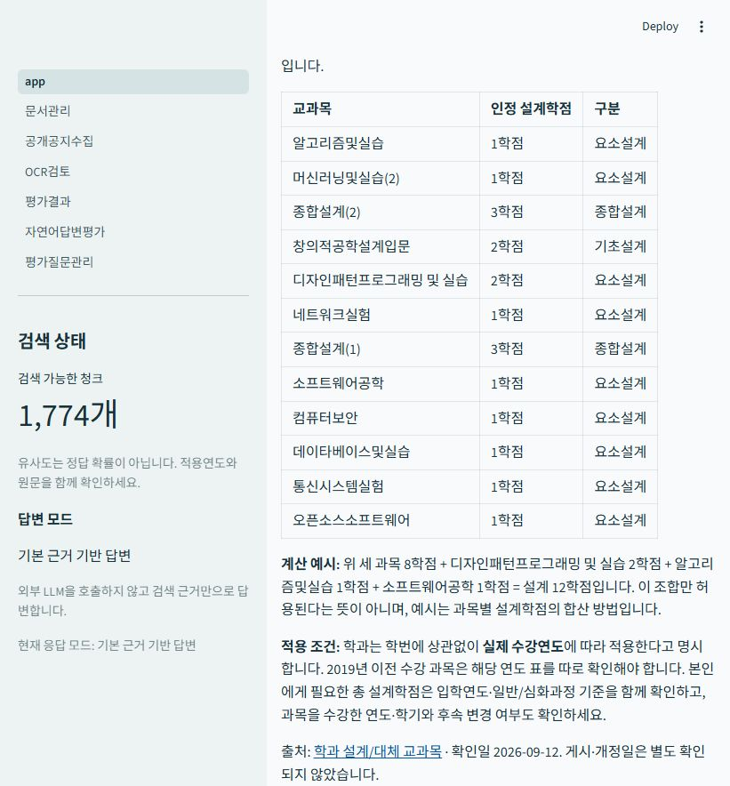

# 저장소 검토 및 수정 기록 — 2026-10-01

## 검토 기준

GitHub `master`의 `7122adccd652c512053690acc3a599168983b563`을 내려받아 기존 테스트 170개 통과를 확인했다. 이 커밋에는 9월 12일 이후 로컬에서 만든 검토 규정 번들, 설계 인정학점 전체 표, 자연어 평가 및 질문 관리 기능이 포함되어 있지 않았다. 검토 브랜치는 해당 후속 기능과 이번 수정 사항을 함께 포함한다.

설치 스크립트·설정, PDF/CSV/TXT 수집과 전처리, 문서 등록과 OCR 승인, 벡터/BM25 검색, 질문 분류·검토 규정, 기본/LLM 답변과 인용 검사, Streamlit 사용자/관리자 페이지, 평가 데이터·지표·테스트·설명서를 검토했다. 외부 의존성 소스 전체의 보안 감사나 학교 규정의 공식 인증을 수행한 것은 아니다.

## 재현하여 수정한 문제

| 우선순위 | 문제와 재현 조건 | 변경 및 검증 |
|---|---|---|
| 높음 | ‘2학년 1학기 전공필수 과목’을 묻고 문서 유형을 프로그램내규/장학안내로 제한해도 CSV 과목 조회가 선택을 무시했다. | 구조화 과목 조회도 문서 유형 필터를 지킨다. 선택한 PDF만 반환하거나 해당 근거가 없으면 빈 결과를 반환하는 통합 테스트를 추가했다. |
| 높음 | 같은 학과·과목명이 있는 두 교육과정의 학점이나 학수번호가 달라도 중복으로 지워졌다. | 동일한 값과 적용 범위만 중복 제거한다. 기본 답변은 자료별 값과 기준연도를 표시하고 적용 교육과정 확인을 요청한다. 실제 Chroma에 3학점/4학점 두 버전을 색인해 확인했다. |
| 높음 | 서로 다른 등록 문서의 파일명과 페이지/행이 같으면 답변 출처가 하나로 합쳐졌다. | 출처에 문서 ID를 연결하고 이를 검증·중복 제거에 사용한다. 같은 이름의 서로 다른 문서는 유지하고 동일 문서의 반복 출처는 합친다. |
| 중간 | 전체 청크를 한 번의 upsert/delete로 처리하여 Chroma의 요청별 배치 한도를 초과할 수 있었다. | 백엔드가 알려 주는 최대 크기로 분할 저장·삭제한다. 제한을 2건으로 설정한 실제 Chroma 통합 테스트에서 5건 저장 후 4건 삭제를 검증했다. |
| 높음 | 검토한 HTML 원본이 Windows Git 체크아웃의 줄바꿈 변환을 거치면 SHA-256 검사가 실패해 규정 답변이 보류될 수 있었다. | `.gitattributes`로 검토 원본의 바이트를 보존한다. 원본의 공백도 수정하지 않는다. |

기존 테스트 중 문서 유형 무시와 서로 다른 학수번호를 중복 제거하도록 기대했던 두 사례도 새로운 동작 계약에 맞게 고쳤다. 단순히 실패를 숨긴 것이 아니라, 필터 보존·충돌 정보 보존과 완전히 동일한 자료의 중복 제거를 함께 검증한다.

## 실행 검증 결과

- Windows / Python 3.12 기존 검증 가상환경 사용. 새로운 가상환경에서 모든 의존성을 재다운로드하는 설치 시험은 수행하지 않았다. `pip check`는 충돌 없이 통과했다.
- GitHub 기준 커밋: 170개 테스트 통과. 후속 기능·이번 수정 반영본: **231개 테스트 통과**. 이 중 문서 관리·OCR·공개 공지·질문 등록·채점 페이지는 Streamlit AppTest로 검증했다.
- 새 Git 체크아웃에서 `scripts.initialize`, `scripts.prepare` 실행: PDF 7개(295쪽), CSV 1개(57행), TXT 1개, 처리 오류 0건. 스캔 PDF·미지원 참고 파일 등 경고 18건은 처리 보고서에 남았다.
- 기존 색인을 복사하지 않고 캐시된 `intfloat/multilingual-e5-base` 모델로 5개 문서의 **1,774개 검색 청크**를 새로 생성했다. OCR 미승인 스캔 PDF 4개는 기본 검색에서 제외된다.
- 로컬 Streamlit 서버를 띄우고 `/_stcore/health`의 `ok` 응답 확인. 실제 브라우저에서 설계 인정학점 12학점 구성 질문과 학수번호 704814 조회의 답변·출처를 확인했다.
- 자연어 개발 질문 31개: 실행 오류 0, 사람 채점 0. 실행 파일 `c767b7be48a94bda99eaa3adf0a227d7.json`은 로컬 평가 폴더에 저장했다. 독립적인 실제 학생 정확도로 해석하지 않는다.
- 이번 검토에서 유료 OpenAI API는 호출하지 않았다. LLM 인용 검증·실패 시 기본 답변 전환은 테스트용 provider로 확인했다. 계정 결제·한도·실제 모델 응답은 별도 연결 시험이 필요하다.
- GitHub 자동 CI 실행이나 다른 검토자의 승인 결과를 주장하지 않는다. 위 테스트 결과는 로컬 실행 결과다. 수정은 검토 브랜치와 초안 PR로 전달하며 자동 병합하지 않는다.



## 현재 구현과 제출 시 설명할 범위

- 이 프로그램은 **정확 과목 조회 + 수동 검토 규정 + 하이브리드 검색 + 선택적 LLM 원문 선택**을 조합한 시스템이다. 모든 질문이 LLM으로 처리되는 범용 챗봇은 아니다.
- 검토 규정 답변은 등록 문서 검색보다 먼저 적용된다. 관리자가 새 문서를 업로드해도 `config/reviewed_rules`의 검토 요약이 자동으로 갱신되지는 않는다. 새 원문을 검토해 전사·요약·해시·적용 범위를 함께 갱신해야 한다. 문서 관리 화면에도 이 점을 표시했다.
- LLM의 원문 발췌가 검색 근거에 존재하는지는 검사하지만, 인용한 문장이 질문에 완전하게 답하는지 또는 예외를 모두 담았는지는 별도 검토가 필요하다.
- 학과 졸업학점 검토표는 2020학번까지 확인한 자료다. 2021학번 이후, 일반과정, 편입·복수전공 등 특례는 추가 원문이 필요하다. ‘확인일’은 ‘시행일’이나 ‘최신 규정 보증’이 아니다.
- 설계 인정학점은 교과목 전체 학점과 구별하며, 현재 검토표는 2019학년도 1학기 이후 수강 기준이다. 기초·종합설계 3과목의 합 8학점과 요소설계 추가 인정학점을 구분한다.
- 스캔 PDF는 OCR 원문 대조와 승인 전까지 검색되지 않는다. 학교 원문의 표 숫자와 조건은 사람의 검토가 필요하다.
- 학년·학기·과정은 현재 질문과 선택한 조건에서 읽는다. 대화 전체를 기억하는 다중 턴 상담 기능은 구현되어 있지 않다.
- 색인 쓰기는 잠금으로 직렬화하지만, 여러 배치 저장 도중 전원 종료·디스크 장애까지 전체 롤백하는 구조는 아니다. 오류 시 원본을 보존하고 `python -m scripts.prepare`로 다시 준비한다.
- 검색 시 전체 후보 조회와 BM25 구성 비용이 있어 큰 학교 전체 문서로 확장하려면 별도의 성능 측정과 최적화가 필요하다. 현재는 로컬 졸업작품 시연 범위다.
- `ARCHITECTURE.md`, `PROJECT_PLAN.md`, `IMPLEMENTATION_CHECKLIST.md`는 초기 장기 계획이다. 작업 큐·활성/대기 색인·SSO 등은 실제 구현 기능과 구분해야 한다.

## 사용자에게 필요한 자료

1. **대상 학번과 과정**: 발표에서 지원한다고 할 범위. 예: 소프트웨어융합학과 2020학번 심화과정 또는 2021학번 이후까지 포함.
2. **최신 공식 원문**: 해당 학번의 졸업요건표·프로그램 내규·설계 인정학점표·외국어 요건과 이후 개정 공지. 적용 시기와 원문 URL이 필요하다.
3. **실제 학생 질문 20~30개**: AI 예시를 보지 않고 작성한 질문을 이름·학번 없이 수집. 기대 답변·출처 또는 추가 질문/보류 이유를 함께 검토한다. 개발용과 최종 평가용은 같은 의미의 질문 그룹이 겹치지 않도록 나눈다.
4. **교수 평가 기준·보고서 양식**: 구현, 성능 평가, 논문 형식 등 요구 비중과 AI 보조 사용 표기 기준. 11월 9일 제출/발표 일정에 변경이 있으면 반영한다.
5. **시연 환경**: Windows 버전, RAM, 인터넷 가능 여부, 본인 노트북 사용 여부. 처음 모델을 내려받는 설치 시간과 질문 한 건의 응답 시간을 구분해 준비한다.

API 키, 학교 로그인 비밀번호, 개인 성적표는 채팅이나 GitHub에 제공할 필요가 없다.

## 재현 명령

Python 3.12의 검증 환경에서:

```powershell
python -m pip check
python -m pytest -q
python -m scripts.initialize
python -m scripts.prepare
python -m streamlit run app.py --server.address 127.0.0.1
python -m scripts.evaluate_natural --mode hybrid
```

일반 설치는 `setup.cmd`, 실행은 `start.cmd`를 사용한다. 관리자 질문 수집·채점 방법은 [자연어 평가 진행 방법](자연어평가_진행방법.md)을 참고한다.
