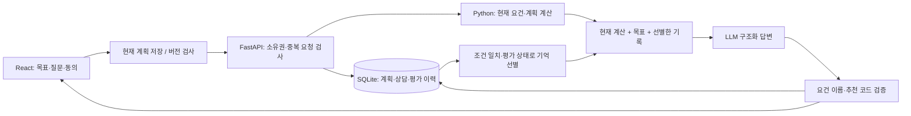
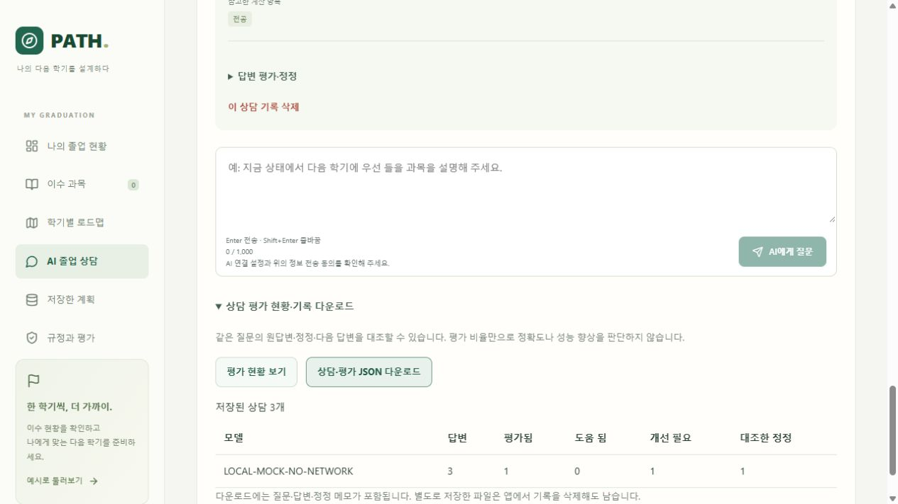

# 상담 이력과 사용자 선호를 활용한 개인화 AI 상담

2026-10-09. React 웹앱의 AI 졸업 상담에 적용했다. DB에 기록을 넣는 것만으로 모델이 학습하지는 않는다. 사용자가 저장한 목표와 현재 조건에 맞는 대화를 다음 질문에 함께 전달하는 방식이다.

## 사용 방법

1. **AI 졸업 상담 → 기억할 나의 목표**에서 관심 분야, 학기당·마지막 학기 희망 학점, 마지막 수강 희망 연도·학기, 요청을 입력한다. 예를 들어 2027년 2학기는 2028년 2월 졸업 희망을 뜻한다.
2. **목표·현재 계획 저장**을 누른다. **희망 학점 한도를 계획에 적용**하면 학기별 상한을 바꾸고 직접 배치를 자동 계획으로 전환한다. 로드맵에서 다시 계산해야 한다. 희망 시점을 입력하는 것만으로 학기를 추가하거나 졸업 가능을 판정하지 않는다.
3. AI 전송 항목에 동의하고 질문한다. 처음 질문하면 현재 계획을 먼저 저장한다. 변경 사항이 있으면 새 버전으로 저장한 다음 상담한다. 질문·답변은 해당 계획에 연결된다.
4. 재접속 후 **저장한 계획 → 불러오기 → AI 졸업 상담**을 열면 목표와 대화가 복원된다. 최근 50개부터 표시하며 이전 기록을 더 불러올 수 있다.
5. 답변의 **답변 평가·정정**에서 평가, 정정 내용, 대조한 근거를 남긴다. 실제 자료와 대조했을 때만 체크한다. 이 표시는 사용자의 확인이며 학교가 승인한 사실을 뜻하지 않는다.
6. **상담 평가 현황·기록 다운로드**에서 모델별 평가 건수와 상담·정정 이력 JSON을 확인한다. 개별 상담 삭제 시 그 상담의 평가 이력도 삭제된다. 계획 삭제 시 연결된 모든 상담이 함께 삭제된다.

목표는 **계획별**로 저장한다. 다른 계획·계정에 자동 공유하지 않는다. 기본 로컬 모드에서는 같은 실행 서버에 접근한 사람이 같은 로컬 자료를 볼 수 있다. 여러 사용자 시연은 `PLANNER_AUTH_REQUIRED=1`의 계정 모드를 사용한다.

## 다음 상담에 참고하는 조건

- 최신 Python 계산값·검토 규정이 항상 우선이다. LLM이 과거 문장으로 학점·졸업기준을 변경할 수 없다.
- 이수 내역, 과정·학번, 계획 조건, 목표 또는 규정 자료가 바뀐 대화는 기록으로 남지만 다음 상담에 보내지 않는다. 화면에 과거 조건이라는 표시가 나온다.
- 어학 유효기간·제출 확인의 시간에 따른 상태 변화도 감지한다. 날짜만 하루 바뀌고 상태가 같다면 대화를 유지한다.
- 최근 100개 완료 기록 중 현재 입력·규정 해시가 같은 유효 AI 답변 최대 6개를 오래된 순으로 전달한다.
- 개선 필요 평가 또는 미확인 정정이 붙은 원답변은 제외한다. 정정 내용·근거가 있고 사용자가 대조 완료한 정정만 최대 3개 전달하며 원답변은 재사용하지 않는다.
- 정정·삭제된 답변을 참고했던 후속 답변도 제외한다. 각 답변에 참고한 기록 ID·버전을 저장하며, 최근 100개 범위에서 의존 관계를 확인할 수 없는 기록도 보수적으로 제외한다.
- **이전 상담과 근거 대조한 정정을 다음 질문에 참고**를 해제하면 대화·정정을 전달하지 않는다. 명시적으로 입력한 개인 목표는 현재 질문의 조건으로 남는다.
- 동의를 해제하거나 자료를 불러오는 것은 저장 기록을 삭제하지 않는다. AI 호출은 다시 동의한 후에만 가능하다.

## 설계

`backend/advisor.py`가 저장·기억 선별·평가 API를 담당하고 `backend/service.py`가 매 질문의 계산과 LLM 호출을 맡는다. 브라우저가 임의로 전달한 과거 답변은 저장형 상담 경로에서 무시한다. `frontend/src/CounselingMemory.tsx`는 목표·피드백·평가 현황 화면을 담당한다.

DB v5는 기존 6개 테이블에 `chat_turns`, `chat_feedback_events`를 추가한다. 내부 자동 증가용 `sqlite_sequence`는 앱 테이블 수에 포함하지 않는다. 기존 과목·계획·소유권·저장 버전은 유지한다.

| 저장 위치 | 내용 |
| --- | --- |
| `profiles.settings_json.counseling_preferences` | 관심 분야, 희망 상한, 마지막 수강 목표, 요청 |
| `chat_turns` | 계획 FK, 요청 ID, 질문·답변·근거, 입력·규정 해시, 생성시각, 진행 상태, 최신 평가·수정 버전 |
| `chat_feedback_events` | 상담 FK, 정정·평가 변경 이력, 변경시각 |

`(profile_id, request_id)` 유일 제약으로 네트워크 재시도의 중복 생성을 막는다. 같은 계획의 상담은 하나씩 처리하며 DB 트랜잭션을 LLM 대기 중 계속 잡지 않는다. 완료 응답의 동일 요청 재시도에는 저장한 결과를 반환한다. 90초가 지난 미완료 기록은 조회 또는 새 질문 시 중단으로 표시한다. 백엔드 LLM 제한은 45초, 자동 재시도 없음이다. 평가 수정·삭제는 리비전 충돌을 검사한다.

| REST API | 기능 |
| --- | --- |
| `GET /api/profiles/{id}/chat?before=n` | 상담 페이지 조회 |
| `POST /api/profiles/{id}/chat/context` | 현재 입력에서 참고 가능한 대화·정정 수, 해시 조회; LLM 호출 없음 |
| `POST /api/profiles/{id}/chat` | 동의·계획 버전 확인, 기억 선별, 최신 계산으로 상담, 저장 |
| `PUT /api/profiles/{id}/chat/{turn}/feedback` | 평가·정정 수정 및 이력 저장 |
| `DELETE /api/profiles/{id}/chat/{turn}?revision=n` | 상담·평가 삭제 |
| `GET /api/profiles/{id}/chat-export` | 전체 상담·평가 이력·모델별 건수 내보내기 |

기존 `/api/chat`은 저장 없는 호환 경로로 유지한다. 새 React 상담은 저장형 경로를 사용한다. 전체 입력 백업에는 목표가 포함되며 상담은 별도 JSON으로 내보낸다. 상담 JSON 자동 가져오기는 제공하지 않는다. 외부 파일의 답변을 검증 없이 상담 기억으로 들이지 않기 위한 범위 선택이다.

## 전송·검증 범위

자유 입력 질문·목표·정정과 선별한 대화는 명시적 동의 후 OpenAI로 보낸다. 과목 성적 등급·학교 로그인 정보·체크리스트 메모는 자동 요약에 넣지 않는다. 자유 입력에 사용자가 직접 쓴 개인정보까지 자동 제거한다고 보장하지 않는다. API 키·전송 동의는 상담 DB에 저장하지 않는다. 삭제 전 다운로드한 파일이나 별도 DB 백업은 앱의 삭제와 연동되지 않는다.

OpenAI Responses의 `store=False` 호출에 필요한 대화 문맥을 매번 전달한다. 별도 파인튜닝이나 자동 학습을 수행하지 않는다. 설계 참고: [OpenAI Conversation state 공식 문서](https://developers.openai.com/api/docs/guides/conversation-state). `store=False`를 모든 서비스 로그·보존의 부재로 해석하지 않는다.

`tests/integration/test_web_counseling.py`는 가상 DB·모의 제공자로 재접속, 목표·백업 복원, 현재 계산 재반영, 과거·오류 답변 제외, 정정 선별, 소유권, 중복·동시 요청, 실패 복구, 페이지 처리, 삭제, v4→v5 이전을 검증한다. 모델별 도움 됨 비율은 객관적 정확도가 아니다. 학교 기준과 대조한 실제 답변의 품질 향상 여부는 동일 질문·조건의 별도 평가가 필요하다.

검증 결과: 전체 Python 663개 통과(63.21초) 후 정정 의존 관계 테스트 1개를 추가하고 상담 통합 22개를 재검증했다(14.31초). 최종 테스트 모음은 664개다. 프론트엔드 9개와 TypeScript·Vite 빌드, 합성 졸업계산 32/32 통과. 의존성의 폐기 예정 API 경고 2건은 남아 있다.

브라우저에서는 별도 가상 DB와 `LOCAL-MOCK-NO-NETWORK` 응답으로 첫 질문 자동 저장, Enter 로딩, 다음 질문에 대화 1개 전달, 새로 접속한 화면의 목표·기록 복원, 근거 정정 1개 전달, 평가 집계·JSON 다운로드를 확인했다. 목표 한도를 적용하면 4학기 상한이 15·15·15·9로 바뀌고 과거 상담 3개는 참고 대상에서 제외되는 것을 확인했다. 사용자의 성적을 외부 LLM에 전송하지 않았다.

