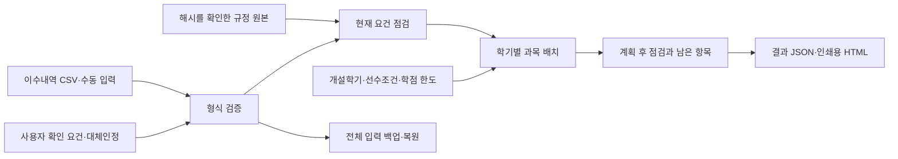

# 개인별 졸업요건 점검 및 이수계획 지원 시스템

## 문제와 목표

총 취득학점만으로는 졸업 준비 상태를 알기 어렵다. 전공·MSC·교양 최소학점, 필수과목, 교양 영역, 설계학점, 제출·승인 요건이 함께 적용되고 재수강·대체과목·과정 변경으로 해석이 달라진다. 이 시스템은 이수내역을 항목별 기준과 대조하고, 부족 요건을 줄이는 학기별 과목 배치와 그 이유를 제공한다.

대상은 2020학번 홍익대학교 세종캠퍼스 소프트웨어융합학과 심화·일반과정, 단일전공 신입학 학생이다. 편입·전과·복수전공의 개별 학점 인정은 지원 범위에서 제외한다. 실제 과정 변경 가능 여부와 승인은 학교에서 확인한다.

## 구성

계산부는 Python/Pydantic 모델로 분리했고 화면은 Streamlit으로 구성했다. 기본 로드맵은 외부 AI 없이 결정적으로 계산한다. 선택적 LLM 모드에서는 과목 우선순위와 설명을 제안받고 기존 계산기로 배치를 검증한다. 기존 문서 검색 기능은 근거 탐색을 보조하며, 검색 답변을 그대로 졸업 판정의 수치 규칙으로 사용하지 않는다.

## 데이터와 계산

`Attempt`는 실제 이수 과목과 성적·수강시점을, `Candidate`는 후보 과목·개설학기·선수조건·선택 대안을 담는다. `Profile`은 과정·개인 필수목록·수동 확인·대체인정을, `PlanOptions`는 계획 기간과 학점 한도를 담는다.

현재 합계는 취득 상태의 통과 성적만 인정한다. 중복 취득이나 동일과목의 여러 취득 건은 모두 보류해 사용자가 인정할 한 건을 정하도록 한다. 동일과목은 연결 관계를 묶어 중복을 검사한다. 대체인정은 공식 확인했다는 사용자 입력과 과정·수강기간에 맞는 실제 취득 건이 있을 때 원래 필수요건만 충족한다. 반대 방향이나 연쇄 대체, 선수조건 면제는 자동 추론하지 않는다.

교양 인정 상한 초과분은 총 인정학점에서 제외한다. 설계학점은 전공학점에 포함되는 부분으로 총학점에 다시 더하지 않는다. 전문교양과 일반 교양선택은 구분한다. 영역 수와 필수 영역, 필수과목은 학점 합계와 별도로 검사한다. 지정 교양·전공기초영어 인정 여부, 과정 변경 승인, 설계 순서 등의 미확인 상태는 계산만으로 자동 완료되지 않는다.

## 배치 알고리즘

각 정규학기 시작 시점에 이미 완료된 선수과목 집합을 고정한다. 해당 학기에 개설된다고 입력한 과목 중 선수조건과 학점 한도를 만족하는 후보를 평가한다. 과목을 추가했을 때 감소하는 부족량을 요구량으로 정규화하고, 총학점보다 세부 요건 감소에 높은 가중치를 부여한다. 직접 부족량을 줄이지 않더라도 유용한 후속 과목에 필요한 선수과목에는 배치 우선순위를 부여한다.

점수/학점이 높은 과목부터 선택하고 학기별로 반복한다. 동일 학기에 배치한 과목은 해당 학기의 다른 과목 선수조건으로 사용할 수 없다. 순환·누락된 선수조건, 알려지지 않은 개설학기, 기간 내 미배치 요건은 남은 항목으로 표시한다. 계획 시작 이전에 완료되지 않은 취득내역을 이미 완료된 선수과목처럼 쓰지 않도록 시작 시점도 검증한다.

이 방식은 탐욕적 휴리스틱이다. 최단 졸업이나 최적해를 보장하지 않는다. 제한된 학점에 들어맞는 더 좋은 조합이 있을 수 있으며 시간표 충돌·정원·계절학기 배치·동시수강 예외는 구현하지 않았다. 기본 후보의 선수조건을 공식 확인하지 않은 상태에서는 학습 순서가 적절하다고 보장할 수 없다.

## 출처 검토

- 2026 교과과정 책자(안): 2020학번 심화/일반에 해당하는 PDF 8·12쪽. 저장 발췌본 9쪽과 재다운로드 원문의 텍스트가 일치했다. 일반과정 세부 기준은 확정본·학과 확인이 남아 있다.
- [2026-03-01 대학 공통 내규](https://archien.hongik.ac.kr/archien/0402.do?articleNo=149705&mode=view): 2026-10-05 원본 7쪽을 확보하고 전 페이지를 렌더링해 검토했다. 제3조의 심화과정 적용 범위와 제6조의 소프트웨어융합학과 포함을 확인했다. 심화 학점·교양 상한, 설계 12학점, 설계 이수순서, 과정 변경 승인 절차를 대조했다.
- 학과 심화 졸업표·설계교과목표·어학 개정 공지: 기존 검토 자료와 함께 사용한다. 학과별 선수관계·동일/대체과목의 전체 확정 목록은 아직 확보하지 못했다.

공통 내규의 해시는 `f3ad1d91b39d441675a0892d165ba47b65cbc0b4f04cfecc361018cedbc698a4`다. 원문과 조항별 검토 메타데이터를 `config/reviewed_rules`에 보존하고 계산 시 원문 해시를 확인한다. 이 원문을 확보했다고 해서 일반과정 확정 자료까지 확보한 것은 아니다.

## 검증과 재현

단위 시험은 성적·재수강·동일과목·대체인정 기간·교양 상한·영역·선수조건·CSV·백업 유효성·HTML 이스케이프 등을 검사한다. 화면 시험은 이수내역 입력, 과정 전환, 관계 등록·삭제, 백업 복원, 계획 생성을 검사한다. 별도 합성 평가기는 두 과정에 각 7개씩 총 14개 시나리오의 기대값과 계산값을 비교한다.

`python -m scripts.evaluate_planner`로 합성 평가를 재현할 수 있다. 세부 결과는 함께 제공한 `evaluation/evaluation.md` 또는 저장소의 `output/planner/evaluation/evaluation.md`에 있다. 전체 자동 테스트 결과는 개발계획의 최종 검증 기록을 참조한다.

합성 평가 통과율은 실제 학생 대상 정확도가 아니다. 동의받은 비식별 이수내역과 학교의 최종 판정으로 비교하는 실증 평가는 미완료다. 이 점은 발표·보고서에서도 그대로 밝힌다.

## 입력 보관과 배포

기본 모드는 학생 입력을 세션 메모리에서 처리하며 외부 AI에 전송하지 않는다. LLM 모드는 사용자가 전송에 동의하고 생성 버튼을 누를 때만 제한된 요약을 OpenAI로 보낸다. 원 성적등급·학생 식별정보·대체인정 메모는 요청에서 제외한다. 백업은 크기·버전·형식·추가 필드·중복 키를 검사하며 API 키와 전송 동의를 포함하지 않는다. 복원 시 현재 규정으로 다시 계산하고 전송 동의를 해제한다.

LLM 연동은 [OpenAI Structured Outputs](https://developers.openai.com/api/docs/guides/structured-outputs?api-mode=responses)의 Responses API/Pydantic 형식에 맞춘다. 구조화 응답도 내용이 맞다는 보장은 없으므로 후보 허용 목록·중복을 추가 검사한다. [공식 API 안내](https://developers.openai.com/api/docs/guides/migrate-to-responses)에 따라 `store=false`를 지정하며 네트워크 타임아웃은 45초, 자동 재시도는 0회다. 모델의 우선순위는 유효한 후보의 계산 점수에 최대 1.5배를 곱할 뿐 개설·선수·학점·동일과목 검사를 우회하지 못한다. 설명 문장의 모든 사실을 자동 검증하는 것은 아니므로 UI와 보고서에서 참고 의견으로 표시한다.

인쇄용 HTML은 모든 사용자 입력을 이스케이프하고 외부 리소스와 스크립트를 사용하지 않는다. 실행 패키지는 명시적 허용 목록으로 생성해 `.env`, 계정 정보, 실제 성적 파일, 브라우저 다운로드, 벡터 DB, 임시파일을 포함하지 않는다. 패키지에는 파일별 SHA-256 목록과 실제 확인에 사용한 의존성 목록을 포함한다.

## 최종 제출 전 남은 외부 검증

일반과정 확정 기준, 본인별 필수목록, 실제 개설·선수관계·설계 순서, 학과의 대체인정 자료, 비식별 사례 평가, 별도 PC 설치 및 실제 시연 영상은 추가 확인해야 한다. 제출 형식이 지정되어 있다면 이 문서의 내용과 확인된 결과를 그 서식에 옮긴다. 미완료 항목을 완료했다고 표기하지 않는다.
