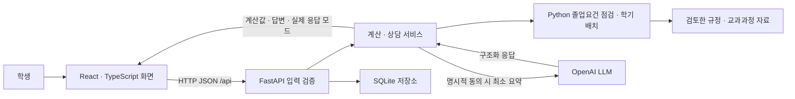
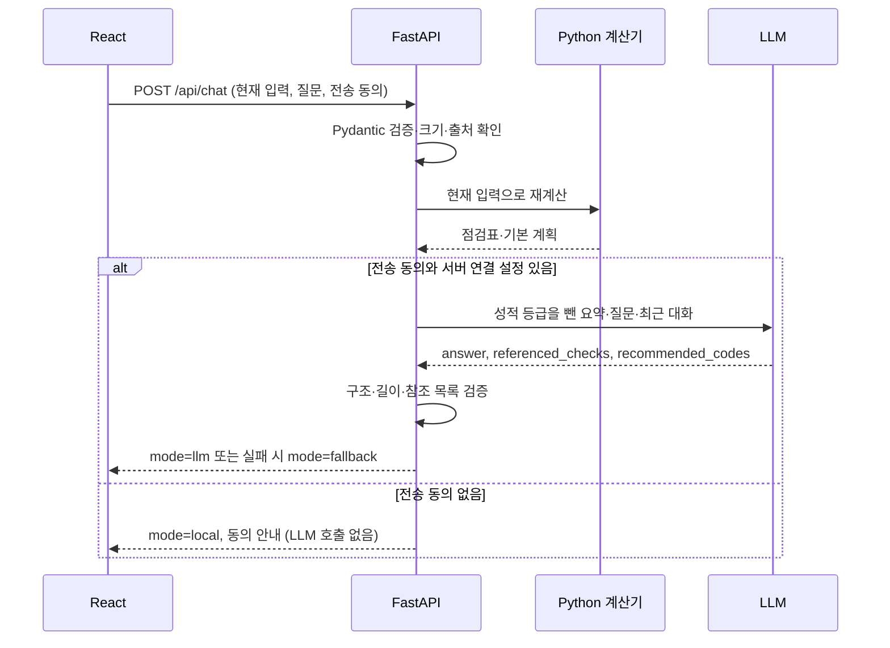
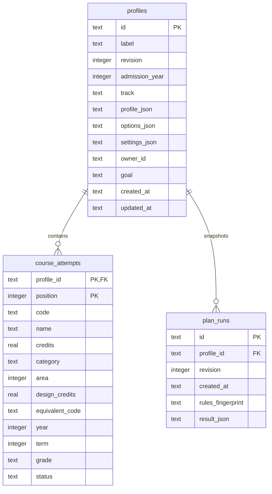

# PATH: React · FastAPI · SQLite 졸업 로드맵

2026-10-08 갱신. 제출 목표는 2026-11-09이며, 2018~2026학번 소프트웨어융합학과의 심화·일반과정 참고 계획을 지원한다. 첫 화면 상단에서 입학연도와 과정을 선택한다. [학번별 기준과 검증](졸업로드맵_학번선택과검증.md)에 경계 조건과 학교 확인 범위를 정리했다.

계획 비교·수정, 후보·대체인정 편집, 보고서·백업, 근거·평가, 체크리스트, 선택적 계정을 보강했다. 학번 확장 후 전체512개·배포본208개·합성32개 검사를 통과했다. [최종 보강과 검증 기록](졸업로드맵_최종보강과검증.md)에 첨부 자료와 남은 학교 확인 범위를 정리했다.

## 요구 기술과 구현 위치

| 요구 기술 | 실제 구현 | 설명할 핵심 |
| --- | --- | --- |
| UI/UX | 현황, 과목, 로드맵, AI 상담, 저장, 규정·평가 | 입력 → 검토 → 계산 → 조정 → 저장 흐름, 모바일 대응, 오류·진행·미저장 상태 |
| 프론트엔드 | `frontend/src/`의 React + TypeScript + CSS, Vite 빌드 | Python 화면 생성에 의존하지 않는 별도 프론트엔드 프로젝트 |
| 백엔드 | `backend/app.py`, `schemas.py`, `service.py`의 Python/FastAPI | HTTP REST 계약, 입력 검증, 계산 서비스와 저장소의 분리 |
| Python | `src/planning/audit.py`, `planner.py`, `portal_import.py` | 졸업요건·중복·설계학점 계산과 조건 기반 학기 배치, 성적표 파싱 |
| DB | `backend/database.py`의 SQLite 관계형 DB | 6개 테이블, 외래키, 트랜잭션, CRUD, 동시 수정 충돌·소유권 검사 |
| LLM | `src/planning/llm.py`, `backend/service.py` | OpenAI 구조화 응답, 실제 자연어 상담, 최소 정보 전송, 참조 검증, 실패 표시 |

기존 Streamlit 앱도 유지한다. 새 웹앱은 새 프론트엔드와 REST 백엔드를 실제로 구현한 별도 실행 경로다. 개발할 때는 React 개발 서버(5173)와 Python 서버(8000)를 각각 실행한다. 배포 빌드에서는 FastAPI가 빌드된 정적 파일도 제공하여 한 명령으로 시연할 수 있다. 이때에도 화면 코드는 React, 데이터 처리는 REST API다.

## 빠른 실행

Windows, Python 3.11 이상, Node.js 22.12 이상 또는 24 LTS가 필요하다.

1. 프로젝트 루트에서 `setup_web.cmd`를 실행한다. Python 의존성 설치, `npm ci`, 타입 검사, React 빌드를 수행한다.
2. `start_web.cmd`를 실행한다.
3. 브라우저에서 [새 웹앱](http://127.0.0.1:8000/)을 연다. Codex 내부 브라우저에서도 같은 주소를 사용한다.
4. [API 문서](http://127.0.0.1:8000/docs)에서 입력 스키마와 REST 경로를 확인한다.
5. 종료하려면 실행 터미널에서 Ctrl+C를 누른다. 다음 실행 시 DB는 그대로 유지된다.

이미 준비된 PC에서는 `start_web.cmd`만 실행한다. 소스를 수정한 후에는 `frontend`에서 `npm.cmd run build`를 실행하고 백엔드를 재시작한 뒤 브라우저를 새로고침한다.

개발 서버를 각각 실행하는 방법:

```powershell
# 터미널 1: 프로젝트 루트
.venv/Scripts/python.exe -m uvicorn backend.app:app --host 127.0.0.1 --port 8000 --no-access-log
```

```powershell
# 터미널 2: frontend 폴더
npm.cmd run dev
```

개발 화면은 `http://127.0.0.1:5173`이다. Vite가 `/api` 요청만 백엔드 8000으로 전달한다. 허용한 출처는 localhost/127.0.0.1의 8000·5173 포트다. 포트를 바꾸면 백엔드 허용 출처도 함께 검토해야 한다.

## 구조와 요청 흐름



졸업요건 숫자와 충족 여부는 Python 계산기의 결과다. LLM은 그 결과를 바탕으로 질문에 답하거나 후보 과목의 우선순위·추천 이유를 제안한다. 추천 우선순위는 계산기에 다시 적용되어 학점·중복·입력된 개설·선수조건 검사를 거친다. 상담 응답의 요건 이름과 추천 코드는 실제 제공한 목록에 속하는지 검사한다. 자연어 문장 자체의 완전한 사실성까지 자동 보증하지는 않는다.



## DB 설계와 CRUD

설계 선택은 1인 개발과 11월 9일 시연 일정에 맞췄다. SQLite에 SQL·관계·트랜잭션·계정 소유권 검사를 구현했다. 기존 계산기를 서비스 계층에서 재사용하며 입력 변경 시 다시 계산한다. AI 요청은 중복 실행을 막고 45초 타임아웃으로 제한한다. 계산 요청은 소유자별 분당 30회, 로그인·등록은 IP별 분당 10회로 제한한다. 제한기는 단일 프로세스 메모리 방식이다. 대규모 공개 서비스에는 PostgreSQL·공통 요청 제한기·작업 큐·실패율 관측을 별도로 검토해야 한다.

기본 파일은 `data/private/planner.sqlite3`이다. Git과 배포 ZIP에서 제외한다. 별도 테스트 DB는 `PLANNER_DB_PATH`로 지정할 수 있다. 이름·학번·학교 비밀번호를 위한 컬럼은 없다. 사용자가 입력한 과목·성적·희망 사항은 **저장 버튼을 누를 때만** 로컬 DB에 저장된다. 별칭이나 자유 입력에 개인정보를 적지 않는다.



- `profiles`: 계획 별칭, 과정, 확인 상태, 수강 조건과 수정 버전. 가변적인 수동 확인·대체관계는 검증된 JSON으로 저장한다.
- `course_attempts`: 과목별 이수 내역을 별도 행으로 정규화한다. 같은 학수번호의 재수강을 보존하기 위해 학수번호에 유일 제약을 걸지 않는다.
- `plan_runs`: 저장 버전별 기본 계산 결과와 규정 해시. LLM 대화·API 키·전송 동의는 저장하지 않는다. 서버가 다시 계산한 결과만 저장한다.
- 생성·수정 시 `BEGIN IMMEDIATE` 트랜잭션으로 프로필·과목·스냅샷을 함께 반영한다. 중간 실패 시 모두 롤백한다.
- 수정·삭제에는 조회한 `revision`이 필요하다. 다른 창에서 먼저 수정했다면 HTTP 409로 거절한다.
- 부모 항목 삭제 시 외래키 `ON DELETE CASCADE`로 관련 과목·계획 기록을 함께 삭제한다. 앱에 휴지통은 없으며 UI가 최종 삭제를 확인한다. OS 수준 안전 삭제를 보장하지 않는다.
- `profiles.settings_json`: 후보, 수동 배치, 체크리스트 등 전체 계획 입력을 저장한다.
- `accounts`: 앱 계정명과 salt를 적용한 scrypt 비밀번호 해시. `sessions`: 토큰 해시·소유자·만료. `evaluations`: 비식별 대조·LLM·사용성 평가 JSON과 소유자.
- 스키마 버전은 `PRAGMA user_version=3`. v1에는 설정·소유자 컬럼을 추가하고, v2→v3에서는 입학연도 CHECK 제약을 2018~2026으로 바꾸고 SW·데이터 인정학점 컬럼을 추가한다. 기존 ID·소유자·과목·이력·리비전을 보존하며 트랜잭션과 외래키 검사로 이전한다. 알 수 없는 버전은 덮어쓰지 않는다.

### 선택적 앱 로그인

기본은 로컬 단일 사용자 모드다. 계정 분리를 시연할 때 서버 실행 전에 설정한다.

```powershell
$env:PLANNER_AUTH_REQUIRED='1'
.venv/Scripts/python.exe -m uvicorn backend.app:app --host 127.0.0.1 --port 8000 --no-access-log
```

학교 계정과 별개의 앱 계정을 만든다. 8시간 세션, HttpOnly·SameSite=Strict 쿠키를 사용하고 HTTPS에서는 Secure를 설정한다. 인증 모드의 계획·이력·평가 조회·수정·삭제는 소유권을 검사한다. 기존 로컬 자료는 자동으로 계정에 옮기지 않는다. 로컬 모드에서 백업한 후 해당 계정으로 로그인해 복원·저장한다. 계정 복구·공개 TLS·다중 프로세스 공통 제한·개인정보 운영 정책은 별도 범위다.

## REST 계약

| 메서드·경로 | 역할 |
| --- | --- |
| `GET /api/health` | 서버 상태 |
| `GET /api/bootstrap` | 초기 조건, 후보 과목, 키를 제외한 LLM 설정 상태 |
| `GET /api/demo` | 개인정보 없는 가상 과목 8개 |
| `GET /api/transcript/template` | 지정 CSV 예시 양식 |
| `POST /api/import/portal` | 클래스넷 복사 표 파싱·미리보기 |
| `POST /api/import/csv` | 지정 CSV 파싱·미리보기 |
| `POST /api/analysis` | 요건 점검·학기별 계획, 동의 시 LLM 설명 |
| `POST /api/chat` | 현재 상태를 다시 계산해 LLM 질의응답 |
| `POST /api/profiles` | 계획·과목·기본 계산 스냅샷 생성 |
| `GET /api/profiles` | 저장 목록 조회 |
| `GET /api/profiles/{id}` | 저장 입력 조회 |
| `PUT /api/profiles/{id}` | 같은 저장 항목 수정·새 버전 기록 |
| `DELETE /api/profiles/{id}?revision=n` | 해당 계획과 관련 데이터 삭제 |
| `GET /api/profiles/{id}/history` | 최근 저장 스냅샷 20개 조회 |
| `POST /api/plan/validate`, `/api/compare` | 수동 배치 검증·학점 상한 비교 |
| `POST /api/export/backup`, `/api/export/csv`, `/api/export/report` | 전체 입력 JSON·과목 CSV·HTML 보고서 |
| `POST /api/import/backup` | 웹 v1·Streamlit v2 전체 입력 복원 검증 |
| `GET /api/sources` | 첨부 원본 해시·검토 사항 |
| `GET/POST /api/evaluations`, `DELETE /api/evaluations/{id}` | 합성 평가 조회·수작업 평가 CRUD |
| `GET /api/auth/me`, `POST /api/auth/register`, `/api/auth/login`, `/api/auth/logout` | 앱 계정·세션 |

변경 요청에는 `X-Planner-Request: 1` 헤더가 필요하다. 허용하지 않은 출처·Host를 거절하며 API 응답은 `Cache-Control: no-store`다. 선택적 인증·소유권 제어를 구현했지만 기본 실행은 127.0.0.1의 로컬 시연이다. 공개 배포에는 TLS·운영 정책·별도 보안 검토가 필요하다.

## LLM 설정과 확인

서버는 프로젝트 `.env`의 기존 OpenAI 설정을 읽는다. 키 값을 프론트엔드에 전달하거나 DB에 저장하지 않는다.

```dotenv
OPENAI_API_KEY=본인의_API_키
OPENAI_MODEL=본인_계정에서_사용_가능한_모델명
```

현재 PC에 설정되어 있던 모델은 `gpt-4.1-mini`이며 모델을 임의로 바꾸지 않았다. 기존 `LLM_API_KEY`·`LLM_MODEL_NAME`도 공식 OpenAI 주소 설정일 때만 재사용한다. 프로젝트 전체 검색의 `LLM_ENABLED`와 새 화면의 명시적인 전송 동의는 별개다.

화면에서 전송 항목을 확인하고 동의한 뒤 ‘AI에게 질문’ 또는 ‘AI 설명과 추천 받기’를 누른다. API 이용 비용이 발생할 수 있다. 실제 호출된 답변은 `LLM 답변 · 모델명`으로 표시한다. 연결·응답 검증 실패는 `AI 답변 미생성`으로 구분한다. 입력 변경·저장 항목 불러오기는 동의와 기존 상담을 초기화한다.

Responses API의 구조화 출력과 Pydantic 파싱을 사용한다. `store=False`, 타임아웃 45초, 자동 재시도 0회다. 이 설정은 서비스 전체 데이터 보관 정책을 대체하지 않는다. 공식 문서: [Structured outputs](https://developers.openai.com/api/docs/guides/structured-outputs?api-mode=responses).

## 5분 시연 순서

1. ‘예시로 둘러보기’: 가상 과목 8개, 현재 인정 21학점과 남은 요건을 보여준다.
2. ‘이수 과목’: 한 과목을 미확인으로 바꾸면 기존 결과가 사라지는 것을 보여주고 재계산한다. 미확인 학점은 보류됨을 설명한다.
3. ‘나의 졸업 현황’: 심화·일반을 변경하고 과목 구성과 별개로 과정 승인 확인이 남는 것을 보여준다.
4. ‘학기별 로드맵’: 15/18학점 비교와 마지막 학기 9학점, 과목 이동 오류·복구, 추천·미배치 이유를 보여준다. 비교는 같은 기간의 조건 비교이며 최단 졸업을 보장하지 않는다.
5. ‘AI 졸업 상담’: 가상 예시로 동의한 뒤 부족한 요건이나 추천 이유를 묻는다. 실제 모델명과 참고한 점검 항목을 보여준다.
6. ‘저장한 계획’: 체크리스트 기한 추가 → 저장 → 새로고침 → 불러오기 → JSON 백업 복원·보고서 다운로드. HTML을 열어 인쇄 → PDF로 저장할 수 있다.
7. ‘규정과 평가’: 원본 검토 사항과 합성 평가·실제 사람의 대조 기록 구분, 시간 측정·만족도 폼을 보여준다.
8. `backend/database.py`, `/docs`, `frontend/src/`와 구조도를 함께 설명해 프론트엔드·백엔드·DB가 어떻게 통신하는지 제시한다.

## 검증과 남은 범위

- 2026-10-07 GitHub 최신 변경 병합 후 전체 Python 자동 테스트: **482개 통과, 32.78초**. API·DB 통합 테스트 38개 포함. 합성 시나리오 14/14 통과. 앞선 기능 보강 시점은 481개 통과였으며 원격의 색인 없는 규정 조회 회귀 테스트 1개를 함께 보존했다.
- 새 통합 테스트: 양 과정 계산, DB CRUD·재접속, 동시 수정 충돌, 원자적 롤백, 삭제 연쇄, 입력·출처·크기 검증, SQL 파라미터 처리, LLM 전송 최소화·오류·참조 검증.
- React TypeScript 검사와 Vite 배포 빌드 통과.
- Codex 내부 브라우저에서 예시 계산 → DB 생성·수정 → 새로고침 → DB 조회·불러오기 확인.
- 실제 화면에서 과목 1개를 미확인으로 변경하면 인정학점이 21→18로 줄고, 원래 분류로 복구하면 21로 돌아오는 것을 확인했다. 390px 모바일 뷰포트에서 문서 전체의 가로 넘침이 없음을 확인했다.
- React 개발 서버 5173과 FastAPI 8000을 별도 실행한 상태에서도 같은 예시 계산과 API 통신을 확인했다. 개발 화면의 브라우저 콘솔 오류는 없었다.
- 배포 ZIP은 별도 폴더에 풀어 포함 테스트·SHA-256 명세·개인 DB와 키 제외 여부를 확인한다. 최종 결과는 배포 옆 `verification-complete-20261007.json`을 참조한다. 같은 PC·기존 가상환경 검증은 새 PC 최초 설치를 대신하지 않는다.
- 가상 예시로 실제 `gpt-4.1-mini` 상담 응답 확인. 응답은 21학점 취득·111학점 부족을 반영했다. 실제 학생 성적은 이 검증에 사용하지 않았다. 한 사례로 LLM의 전체 정확도를 주장하지 않는다.
- HTTP 테스트에서 Starlette/httpx 관련 폐기 예정 API 경고 2건이 있다. 테스트 실패는 아니며 향후 의존성 갱신 시 검토한다.

학교 공식 API·비밀번호 자동 로그인은 제공하지 않는다. 직접 학교에 로그인한 후 표 붙여넣기·CSV 가져오기를 사용한다. 기존 Streamlit의 별도 브라우저 가져오기는 실제 로그인 반복 새로고침 문제가 있어 전체 자동 연동 완료로 제시하지 않는다. 후보 추가·선수/병수·대체인정 편집·HTML 보고서는 React에서도 사용할 수 있다.

일반과정 최종 기준, 학과 내규 최신판, 실제 개설·면제·대체 승인, 수강연도별 설계 인정, 비식별 실제 사례 대조는 학교 확인이 필요하다. 첨부 2026 체계도의 필수·권장 관계를 구분해 반영했으나 빈 선수 목록이 다른 학교 조건의 부재를 보장하지 않는다. 교수자 평가표·제출 서식·영상·다른 PC 설치는 별도 확인한다.
