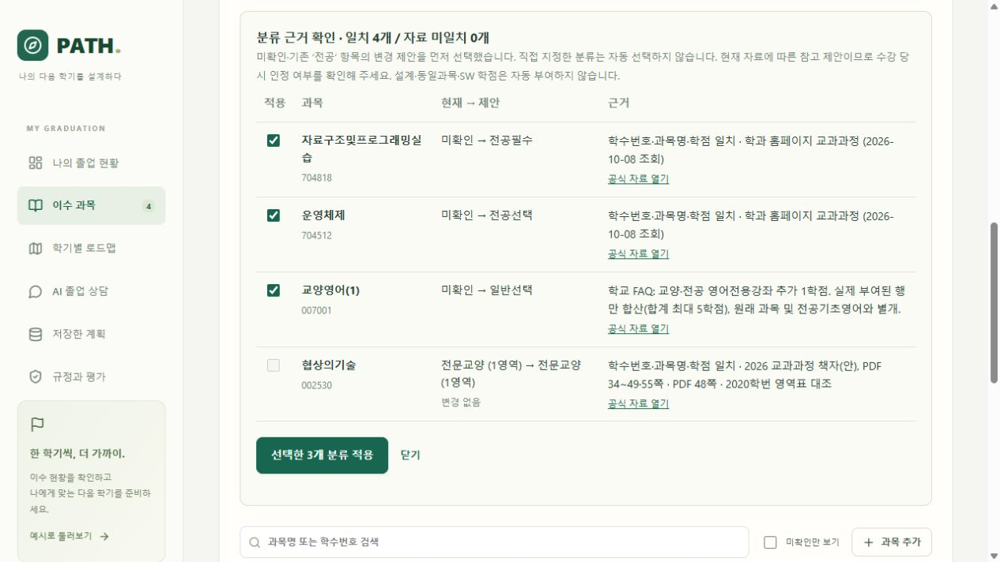

# 이수구분과 영어 추가학점

2026-10-08. 학과 홈페이지와 학교 교과과정 자료를 대조해 분류 규칙을 보강했다. LLM을 재훈련한 작업이 아니라, Python이 사용하는 검토 자료와 LLM에 전달하는 계산 설명을 수정한 작업이다.

## 기존 이수 내역 갱신

1. 저장한 계획을 불러오고 **이수 과목 → 학과 자료로 분류 확인**을 누른다.
2. 현재 값, 제안 값, 공식 출처를 확인한다. 미확인·기존 ‘전공’의 변경 제안만 기본 선택한다. 직접 지정한 이수구분은 필요할 때 직접 체크한다.
3. **선택한 N개 분류 적용**을 누른다. 적용 직후에는 **분류 적용 되돌리기**로 복원할 수 있다. 이후 과목을 수정하면 잘못 덮어쓰지 않도록 되돌리기를 숨긴다.
4. 졸업요건을 다시 계산하고 **저장한 계획 → 사본 저장**으로 보관한다. 새로고침하면 저장한 계획을 다시 불러온다.

새 클래스넷 표를 가져오면 선택 학번으로 분류한 미리보기가 나온다. 확인 후 적용해야 기존 표가 바뀐다. CSV와 저장된 수동 입력은 자동 덮어쓰지 않는다. 학번·과목을 변경하면 이전 분류 미리보기를 다시 사용하지 못하게 한다.

## 반영 규칙

| 항목 | 처리 |
| --- | --- |
| 전공필수·전공선택 | 선택·저장 가능. 기존 ‘전공’도 유지하며 세 구분을 전공 합계에 한 번 더한다. |
| 과목 식별 | 학수번호·정규화한 과목명·학점 모두 일치해야 한다. 공백, 로마숫자, 끝의 `(*)`·`(C)` 표기를 정규화하되 유사 과목을 임의 합치지 않는다. |
| 교양영역 | 2018~2021과 2022 이후 영역표를 구분한다. 영역과 이수구분을 함께 제안한다. |
| 영어전용강좌 추가학점 | 실제 내역의 교양영어(1~5)·전공영어(1~5) 1학점 행을 일반선택으로 처리. 두 종류를 합쳐 최대 5학점. 원래 영어전용강좌와 독립하며 `(*)`만으로 행을 생성하지 않는다. |
| 기초영어 요건 | 영어(001009)·대학영어(001023)와 전공기초영어, 영어 추가학점을 구분한다. 추가학점으로 기초영어 요건을 충족시키지 않는다. |
| 인정학점 | 설계·SW 인정학점·대체과목·승인 상태를 자동 부여하지 않는다. 비전공으로 변경할 때 기존 설계학점이 있으면 초기화 경고를 표시하고 기본 선택하지 않는다. |
| 기존 후보 정정 | 대학영어 001023, 지능형무선통신 704839, 인공지능 704840을 공식 표와 대조했다. 현재 자료에서 확인되지 않은 777016은 자동 추천에서 제외했다. |

전공필수 표시는 교과목 구분이다. 개인별 필수목록·필수 인정·졸업 확정을 대신하지 않는다. 총학점을 충족해도 전공·MSC·설계·제출·승인 등 다른 조건이 남을 수 있다.

## 자료와 한계

검토 목록은 `config/reviewed_rules/course_classification.json`이며 125개 과목 항목과 영어 추가학점 규칙을 담았다. 공개 원본 6개의 SHA-256을 로딩 시 검사한다.

- [학과 교과과정](https://software.hongik.ac.kr/home/templates/curriculum/curriculum), [전공·인증필수](https://software.hongik.ac.kr/home/templates/curriculum/required): 현재 전공 구분. 과거 수강 당시 구분을 모두 증명하지는 않는다.
- [학교 학사FAQ](https://www.hongik.ac.kr/kr/education/academic-faq.do?article.offset=10&mode=list): 영어전용강좌 추가 일반선택 1학점, 합계 5학점 상한, 재수강과의 관계.
- [2026 교과과정 책자](https://ibook.hongik.ac.kr/Viewer/2026curriculum): PDF 34~37·48~49·55쪽의 기초교양·교양영역·MSC. 원본의 ‘안’ 표기를 유지한다.
- [2020 학과 신입생 안내](https://software.hongik.ac.kr/home/templates/community/home_upload/20200305151029.pdf): 과거 영어 및 신호및시스템 구분 대조.
- [학교 게시 전문교양 영역표](https://mide.hongik.ac.kr/mide/0401.do?articleNo=140381&attachNo=82253&mode=download): PDF 5쪽의 2016~2021학번 공학계열 영역표. 예술과건축은 별도 과목으로 반영하고 다른 예술 과목과 합치지 않는다. 다른 쪽의 타 학과 졸업요건은 적용하지 않았다.

공학기초수학(002144)은 추가 검토에서 2026 책자 PDF 37쪽 교양과목 표를 확인해 교양선택으로 제안한다. 기존 수동 입력은 자동 덮어쓰지 않으며 미리보기에서 선택 적용한다. 과거 신호및시스템(704406)은 2020 안내와 현재 홈페이지의 필수 구분이 달라 2026 이전 수강은 ‘전공’으로 남긴다. 사이버강좌의 전문교양·MSC 인정 제한, 수강연도별 설계학점, 개인 면제·대체승인은 학교 확인이 필요하다. 분류 제안의 ‘일치’는 자료와 식별 정보가 맞는다는 뜻이며 학교의 개인별 인정 승인이 아니다. MSC 전산 상한의 현재 처리와 후속 검증은 [MSC 계산 정정](졸업로드맵_MSC계산정정.md)을 참고한다.

## 검증

- 전체 Python **542개 통과, 44.40초**. 테스트를 웹/비웹 의존성으로 분리한 뒤 관련 **53개 통과, 8.91초**.
- TypeScript 검사·Vite 배포 빌드 성공, 합성 시나리오 **32/32** 통과. 의존성 폐기 예정 API 경고 2건.
- 과목 식별 불일치, 학번 경계, 과거 필수 충돌, 수동 값 보존, 전공·설계 합산, 영어 추가학점의 중복·상한·재수강, CSV·DB 복원, 출처 해시 변조와 CSRF 거절을 검사했다.
- 실제 브라우저에서 분류 적용 → 되돌리기 → 재적용 → 사본 저장 → 새로고침·불러오기를 확인했다. 기존 원본은 별도 저장했고 성적·학점·수강 시기 등 분류 외 필드가 변하지 않았음을 로컬에서 대조했다. 개인 내역은 공개 테스트·스크린샷·Git에 포함하지 않았다.
- 공개 과목명과 가상 P 성적으로 만든 4과목의 새 표 가져오기에서 전공필수·전공선택·일반선택·전문교양 구분을 확인했다.
- 390px 모바일 화면에서 페이지 가로 넘침 없이 표 내부를 가로 스크롤할 수 있다. 시연 브라우저의 콘솔 오류는 없었다. Streamlit에서도 학번 변경 시 이전 분류 미리보기를 제거하며 관련 UI 테스트 3개를 통과했다.

웹 배포본은 `output/planner/graduation-roadmap-classification-20261008.zip`이다. 최종 코드를 별도 폴더에 풀고 같은 PC의 기존 가상환경으로 배포본 테스트 **238개, 26.60초**를 통과했다. 테스트 후 변경은 이 검증 문구뿐이며 코드·자료·빌드는 검증본과 바이트 단위로 대조했다. 내부 `MANIFEST.sha256.json`으로 파일 무결성을 검사한다. 개인 DB·성적 백업·API 키는 포함하지 않는다. 다른 PC의 최초 설치는 별도 검증이 필요하다.

자동 테스트는 구현 검증이다. 학교 졸업사정과 대조한 실제 정확도나 LLM 문장 품질 평가가 아니다. 이번 작업에서 개인 이수 내역을 외부 LLM에 보내지 않았다.
