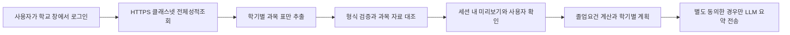

# 학교 성적 가져오기

2026-10-07 갱신. 홍익대학교 클래스넷의 전체성적조회 화면에서 학수번호·과목명·학점·성적·수강시점을 가져와 기존 졸업요건 점검과 LLM 추천에 연결한다. 공식 API를 제공받은 연동은 아니다. 현재 확인된 경로는 Codex 내부 브라우저에서 로그인한 성적표를 일괄 가져오는 방식이다. 별도 Chrome/Edge 자동화 창에서는 보안 확인·반복 새로고침이 발생하여 실제 자동 로그인 연동 완료로 표시하지 않는다.

## Codex 내부 브라우저로 사용하기

1. Codex에게 내부 브라우저에서 `https://cn.hongik.ac.kr/stud/`를 열어 달라고 요청한다. 학교 로그인은 사용자가 직접 진행한다.
2. 클래스넷 → 성적정보 → 전체성적조회를 연다.
3. 첫 학기 제목부터 마지막 과목까지 성적표 전체를 복사한다. 로드맵의 `학교에서 이수내역 가져오기 → 전체성적조회 내용 붙여넣기`에 넣고 `붙여넣은 성적표 확인`을 누른다. Codex에게 이 과목 표를 로드맵으로 옮기도록 요청할 수도 있다.
4. 미리보기의 학기·과목 수, 이수구분·재수강·설계학점을 확인한 뒤 적용한다. 이후 기존 로드맵 계산 또는 별도 동의 후 LLM 추천을 사용한다.

학교 아이디·비밀번호·로그인 쿠키는 로드맵 입력에 포함하지 않는다. 이 기능은 Codex 브라우저의 로그인 세션을 독립 프로그램에 공유하는 기능이 아니다. 독립 실행 시에는 사용자가 성적표를 한 번에 복사해 붙여넣을 수 있다.

## 별도 브라우저 연결 (학교 접속 환경에 따라 실패할 수 있음)

1. Windows에 Chrome 또는 Microsoft Edge와 Python 3.11 이상이 필요하다. `setup_planner.cmd`로 의존성을 설치하고 `start_planner.cmd`로 실행한다. 기존 사용자는 설치 스크립트를 한 번 다시 실행한다.
2. `학교에서 이수내역 가져오기`를 펼치고 브라우저를 선택한 뒤 `학교 로그인 창 열기`를 누른다.
3. 별도로 열린 학교 통합로그인 화면에서 직접 로그인한다. 기존 개인 브라우저의 로그인 정보를 복사하지 않으므로 새 창에서 로그인해야 한다. 추가 인증이 있으면 본인이 진행한다. 보안 확인·반복 새로고침이 발생하면 연결을 종료하고 위의 내부 브라우저 경로를 사용한다.
4. 클래스넷 → 성적정보 → 전체성적조회를 연다. 앱으로 돌아와 `로그인 후 성적 가져오기`를 누른다. 메뉴 링크가 보이는 경우 앱이 전체성적조회를 열어 준다.
5. 가져온 학기·과목 수를 학교 화면과 대조한다. 이수구분·교양영역·설계 인정학점·재수강을 확인하고, 대상 확인을 체크한 다음 `가져온 이수내역 적용`을 누른다. 적용 전까지 기존 이수내역을 유지한다.
6. 부족한 졸업요건을 확인하고 `로드맵 계산` 또는 별도 동의 후 `LLM 맞춤 로드맵 생성`을 사용한다.

## 무엇을 자동으로 알 수 있는가

확인한 전체성적조회는 `학수번호 / 과목명 / 영문과목명 / 학점 / 성적 / 재수강` 열과 학기별 제목을 제공한다. 수강내역 자체에 이수구분·교양영역·설계 인정학점이 없어 이를 학교에서 가져온 확정값으로 표시할 수 없다.

2026 교과과정에서 학수번호·정규화한 과목명·학점이 모두 일치하는 단일 과목에만 이수구분을 제안한다. 수강 당시 기준은 사용자가 확인한다. 나머지는 `미확인`으로 남기며 계산에 포함하지 않는다. 설계학점·교양영역은 모두 0으로 가져와 직접 확인하게 한다. 동일과목·대체인정도 추정하지 않는다. 성적표에 없는 현재 수강중 과목은 별도로 입력해야 한다.

이전 연도 수강내역을 누락시키지 않도록 입력 연도는 2000년부터 허용한다. 지원 졸업규정은 여전히 2020학번이며, 수강내역의 첫 연도로 입학연도를 추정하지 않는다. 2026-10-07 확인한 학교 화면 하단 설명에 따라 공란인 일반 성적은 F, 정확히 `재수강`으로 표시된 행은 인정제외로 가져오며 원 내역은 보존한다. 반복 수강의 최종 인정은 확인한다. 과목명 끝의 `(*)`는 영어 수업, `(C)`는 사이버강좌라는 학교 범례에 따라 과목 대조 시에만 제거한다. 원 과목명은 그대로 표시한다.

## 데이터 흐름과 경계

- `portal.py`: 세션별 작업 스레드·이벤트 루프·별도 브라우저 컨텍스트. 시작 35초/읽기 30초 제한, 10분 미사용 종료. HTTPS의 정확한 학교 호스트·전체성적조회 경로만 읽는다. 여러 성적창이 열려 있으면 합치지 않고 오류를 표시한다.
- `portal_import.py`: 브라우저 표 → 검증된 Attempt 및 검토 정보. 정확한 열/학기 형식을 요구하며 일부 오류가 있어도 부분 성공으로 덮어쓰지 않는다. 최대 500과목. 원본에 없는 인정정보를 확정하지 않는다.
- `portal_ui.py`: 로그인 시작/읽기/종료, 적용 전 검토, 적용 후 기존 계산과 연결. 새 이수내역을 적용하면 이전 LLM 전송 동의를 해제한다.

프로그램은 아이디·비밀번호 입력 필드를 만들지 않고 학교의 입력 필드도 읽지 않는다. 쿠키·프로필·성적표를 파일에 저장하는 코드, 추적 로그, 스크린샷, HAR 또는 storage_state를 사용하지 않는다. 별도 비영구 브라우저 세션은 성공 후 닫고, 실패하면 재시도를 위해 유지한다. 앱 세션에 가져온 성적은 사용자가 백업/CSV를 명시적으로 내려받을 때만 파일로 저장된다. 브라우저나 운영체제의 임시 데이터 처리까지 보장하는 의미는 아니다.

학교 연결은 `PLANNER_LOCAL_PORTAL=1`과 Streamlit의 루프백 바인딩이 모두 필요하다. `start_planner.cmd`가 설정한다. 공유 서버에서 켜지 않으며, 이 PC를 다른 사람과 동시에 공유하는 다중 사용자 서비스로 사용하지 않는다. 학교 CAPTCHA·보안 경고·접근 제한을 우회하지 않는다.

## 검증 범위와 남은 작업

- 사용자 로그인 후 실제 전체성적조회 DOM의 헤더·학기 제목·행 형태와 변환 규칙 호환성을 확인했다. 개인 성적표를 테스트 파일이나 배포 자료에 복사하지 않았다.
- 자동 테스트에는 가상 과목만 사용한다. 계절학기·이전 수강·F·재수강·분류 불일치·중복·형식 변경·다른 도메인 차단·실패 시 기존 입력 보존·LLM 동의 해제를 검증한다.
- 2026-10-06 전체 회귀 테스트 430개 통과(29.07초). 이후 추가한 작업 스레드·오류 정리 테스트 2개를 포함해 연동 단위 테스트 31개도 통과했다. 앱에서 실제 Edge 로그인 창 실행을 확인했다.
- 같은 PC의 기존 가상환경에서 ZIP을 푼 독립 실행본 테스트 129개가 통과했다(10.42초). 이는 새 PC 설치 검증을 대신하지 않는다.
- 초기 직접 로그인 주소 진입에서 사용자가 반복 새로고침을 보고했다. 클래스넷 첫 화면과 정상 로그인 안내를 거치는 순서로 수정했으나 증상이 지속되어 내부 브라우저 경로를 추가했다.
- 2026-10-07에도 별도 브라우저의 반복 새로고침이 재현됐다. Codex 내부 브라우저는 전체성적조회가 정상적으로 표시되어, 과목 표만 로드맵 미리보기로 전달하는 실제 경로를 확인했다. 개인 이수구분 확인·적용과 실제 LLM 요청은 수행하지 않았다. 개인 성적표는 파일이나 배포본에 저장하지 않았다.
- 붙여넣기·학교 성적 범례 반영 후 관련 단위/화면 테스트 51개가 통과했다(6.79초).
- 최종 계산·변환 변경을 포함한 전체 회귀 테스트 443개가 통과했다(25.86초). 이후 내부 브라우저 입력을 기본으로 배치하고 과목 표를 접어서 표시하는 화면 변경 후 UI 테스트 10개도 통과했다(5.94초). 실제 미리보기 표시와 변환 후 원문 입력창 비우기를 브라우저에서 확인했다.
- 학교 화면이 개편되면 읽기를 중단하고 어댑터를 수정해야 한다. 메뉴 개편, 추가 인증, Edge 정책, 네트워크 차단은 실제 PC에서 확인해야 한다.
- 공식 API 제공 여부와 다중 사용자 서비스 운영 허용 범위는 학교 담당 부서와 별도로 협의해야 한다. 현재 버전은 로컬 시연용 연동이다.

참고: [학교 통합로그인](https://my.hongik.ac.kr/my/login.do?Refer=https://cn.hongik.ac.kr/), [Playwright 브라우저 채널](https://playwright.dev/python/docs/browsers), [비영구 컨텍스트](https://playwright.dev/python/docs/api/class-browsercontext), [Windows 이벤트 루프와 스레드](https://playwright.dev/python/docs/library).
